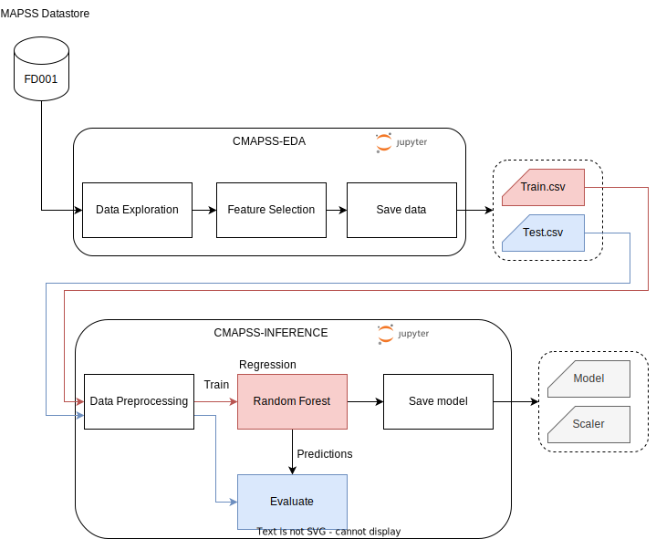
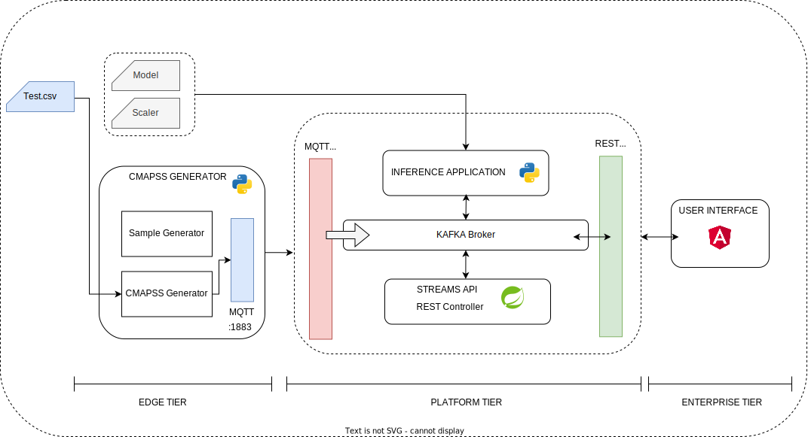
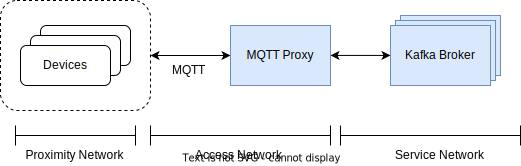
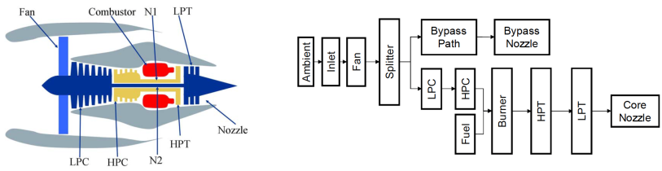
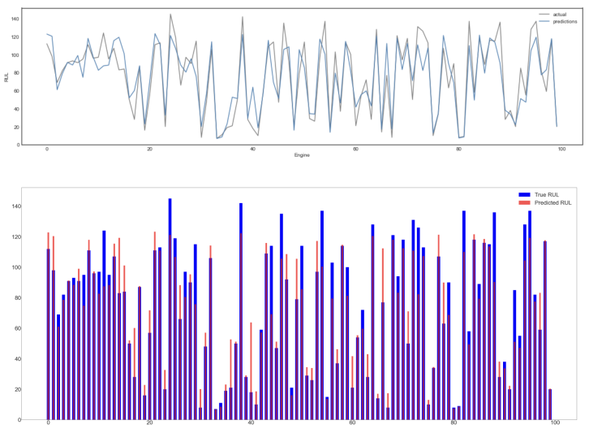
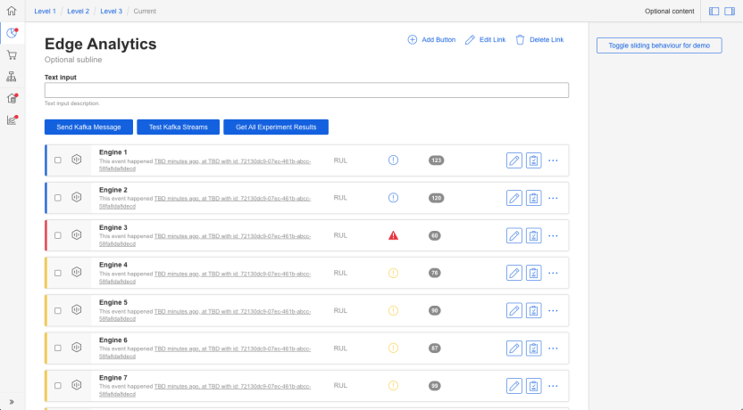

# edge-analytics

## System Architecture

## Use Case
C-MAPSS 

## Tech Stack

Backend
- Spring Boot v3.2.1 with Java 17
    - Spring Web, Spring Security, Spring Kafka, Kafka Streams
- Python 3.9 
    - Check requirements.txt for dependencies

Frontend
- Angular v17.0.10, NodeJS v20.10.0

### Apache Projects Explored/Used in the project

- [x] [Apache Kafka](https://projects.apache.org/project.html?kafka)
- [x] [Apache Zookeeper](https://projects.apache.org/project.html?zookeeper)
- [x] [Apache AVRO](https://projects.apache.org/project.html?avro)
- [x] [Apache ActiveMQ](https://projects.apache.org/project.html?activemq) - Explored but used [Mosquitto](https://mosquitto.org/) instead
- [x] [Apache Maven](https://projects.apache.org/project.html?maven)  
- [ ] [Apache JENA](https://projects.apache.org/project.html?jena) - Explored, only makes sense after integrating with a NoSql DB
- [ ] [Apache Airflow](https://projects.apache.org/project.html?airflow) - Explored, Going to be integrated for multiple data source ingestion pipelines